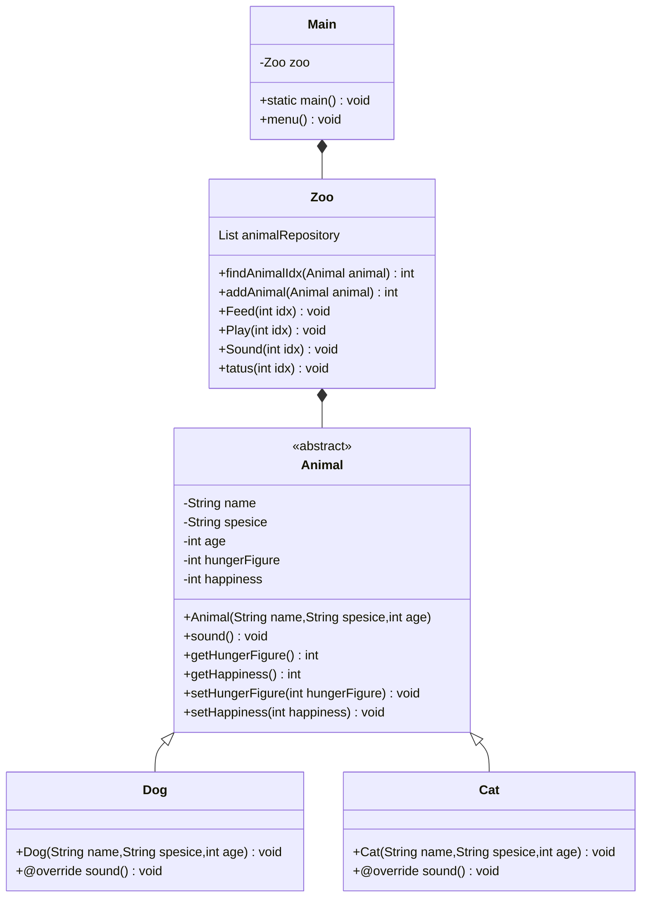

```mermaid
classDiagram
    Main *-- Zoo
class Main{ 
    -Zoo zoo
    +static main() void 
    +menu() void
}
class Zoo{
    List<Animal> animalRepository
    +findAnimalIdx(Animal animal) int 
    +addAnimal(Animal animal) int 
    +Feed(int idx) void
    +Play(int idx) void
    +Sound(int idx) void
    +tatus(int idx) void
}

    Zoo *-- Animal
class Animal  {
<<abstract>>
-String name
-String spesice
-int age 
-int hungerFigure
-int happiness 
+Animal(String name,String spesice,int age)
+sound() void 
+getHungerFigure() int 
+getHappiness() int 
+setHungerFigure(int hungerFigure) void
+setHappiness(int happiness) void
}
    Animal <|-- Dog
    Animal <|-- Cat
class Dog{
    +Dog(String name,String spesice,int age) void
    +@override sound() void 
}
class Cat{
    +Cat(String name,String spesice,int age) void
    +@override sound() void 
}
```
