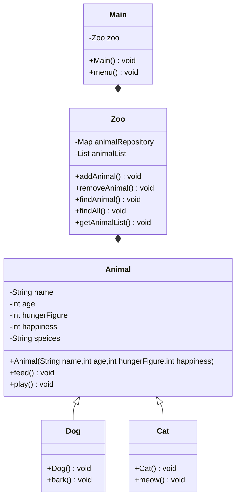

```mermaid
classDiagram
    Main *-- Zoo
class Main{ 
    -Zoo zoo
    +Main() void
    +menu() void 
    
}
class Zoo{
    -Map<String,Animal> animalRepository
    -List<Animal> animalList 
    +addAnimal() void 
    +removeAnimal() void
    +findAnimal() void
    +findAll() void
    +getAnimalList() void
}

    Zoo *-- Animal
class Animal {
-String name   
-int age  
-int hungerFigure
-int happiness
-String speices 
+Animal(String name,int age,int hungerFigure,int happiness)
+feed() void
+play() void
}
    Animal <|-- Dog
    Animal <|-- Cat
class Dog{
    +Dog() void
    +bark() void
}
class Cat{
    +Cat() void
    +meow() void
}
```
