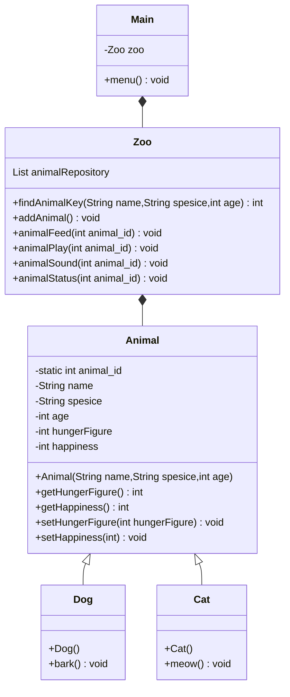

```mermaid
classDiagram
    Main *-- Zoo
class Main{ 
    -Zoo zoo 
    +menu() void
}
class Zoo{
    List<Animal> animalRepository
    +findAnimalKey(String name,String spesice,int age) int
    +addAnimal() void
    +animalFeed(int animal_id) void
    +animalPlay(int animal_id) void
    +animalSound(int animal_id) void
    +animalStatus(int animal_id) void
}

    Zoo *-- Animal
 class Animal {
    -static int animal_id 
-String name
-String spesice
-int age 
-int hungerFigure
-int happiness 
+Animal(String name,String spesice,int age)
+getHungerFigure() int
+getHappiness() int 
+setHungerFigure(int hungerFigure) void
+setHappiness(int ) void
}
    Animal <|-- Dog
    Animal <|-- Cat
class Dog{
    +Dog() 
    +bark() void
}
class Cat{
    +Cat() 
    +meow() void
}
```
