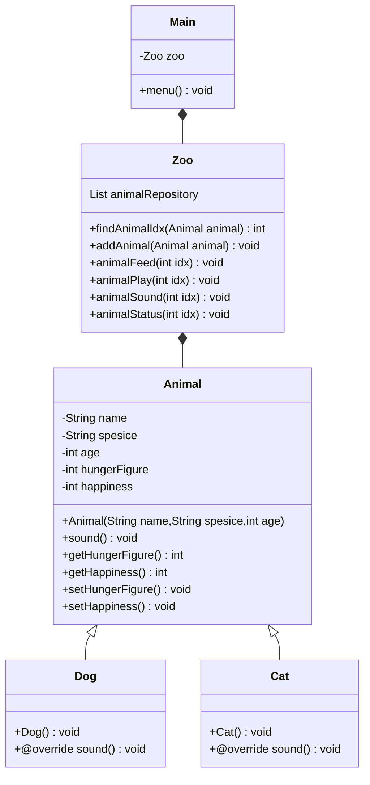

```mermaid
classDiagram
    Main *-- Zoo
class Main{ 
    -Zoo zoo 
    +menu() void
}
class Zoo{
    List<Animal> animalRepository
    +findAnimalIdx(Animal animal) int 
    +addAnimal(Animal animal) void
    +animalFeed(int idx) void
    +animalPlay(int idx) void
    +animalSound(int idx) void
    +animalStatus(int idx) void
}

    Zoo *-- Animal
class Animal {
-String name
-String spesice
-int age 
-int hungerFigure
-int happiness 
+Animal(String name,String spesice,int age)
+sound() void 
+getHungerFigure() int 
+getHappiness() int 
+setHungerFigure() void
+setHappiness() void
}
    Animal <|-- Dog
    Animal <|-- Cat
class Dog{
    +Dog() void
    +@override sound() void 
}
class Cat{
    +Cat() void
    +@override sound() void 
}
```
